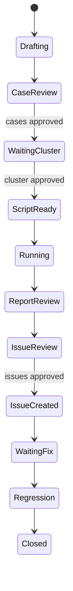

<p align="center">
  <picture>
    <source media="(prefers-color-scheme: dark)" srcset="assets/logo-dark.svg">
    <source media="(prefers-color-scheme: light)" srcset="assets/logo-light.svg">
    
  </picture>
</p>

<h1 align="center">FQA</h1>

<p align="center">
  Feature-level QA orchestration for AI coding agents, with explicit human review gates.
</p>

<p align="center">
  <a href="LICENSE"></a>
  <a href="skills/fqa/SKILL.md"></a>
  <a href="scripts/validate-skill.sh"></a>
</p>

<p align="center">
  <a href="README.md">English</a> | <a href="README_CN.md">简体中文</a>
</p>

---

Tired of large features reaching release review with scattered notes, ad-hoc
scripts, and unclear evidence? FQA turns feature QA into a traceable workflow:
understand the design, model risk, generate cases, wait for human approval,
execute on a cluster, report findings, create approved issues, and rerun
regression.

## Demo

**You:**

```text
Use $fqa to test this feature PR. There is no design doc.
```

**Agent:**

```text
State: Drafting
- Read the code and generated design-understanding.md
- Generated implementation-understanding.md from changed components
- Built a risk model covering API behavior, recovery, compatibility, and observability
- Generated FQA-001 through FQA-008 test cases

Next gate: Please review and approve the test cases, then provide test-cluster access.
```



## Who Is This For

| If you are... | FQA helps you... |
| --- | --- |
| Maintainer reviewing a large feature | Turn a PR or branch into a reviewed QA plan with traceable evidence |
| QA engineer validating a release risk | Generate cluster-level cases, scripts, reports, and regression plans |
| AI agent building test artifacts | Follow a strict state machine instead of improvising a test workflow |

## Key Features

- Generates design and implementation understanding when docs are missing.
- Converts feature risk into structured, reviewable test cases.
- Enforces human gates before script generation, cluster execution, and issue creation.
- Produces reusable artifact templates for plans, cases, scripts, results, reports, and issue candidates.
- Stores workflows under one global FQA base directory, with per-feature `state.yaml`.
- Tracks stable IDs across features, cases, runs, failures, issues, and regressions.
- Supports cluster-oriented QA without pretending to be a unit-test generator.

## Quick Start

Clone the project and install the skill into your Codex skills directory:

```bash
git clone https://github.com/weiliu1031/fqa.git
cd fqa
./scripts/install-skill.sh
```

Update an existing install from a release tag:

```bash
git fetch --tags
git checkout v0.4.0
./scripts/install-skill.sh
```

Or install directly from GitHub with Codex's skill installer:

```bash
rm -rf ~/.codex/skills/fqa
python ~/.codex/skills/.system/skill-installer/scripts/install-skill-from-github.py \
  --repo weiliu1031/fqa \
  --path skills/fqa \
  --ref v0.4.0
```

Restart Codex after installing or updating the skill.

Validate the skill package:

```bash
./scripts/validate-skill.sh
```

Use the skill from an agent session:

```text
Use $fqa to generate feature-level test cases for this PR.
Use $fqa status.
Use $fqa resume fqa-example-20260508-pr123.
```

## Usage

### Start a feature QA workflow

When the user asks FQA to test a feature, FQA uses progressive intake. It first
asks only for enough context to understand the feature and generate cases. It
does not ask for cluster credentials or execution permission until the cases
are approved.

**Input**

```text
Use $fqa to test this feature.
```

**Output**

```text
State: Drafting

I can start once I know the feature source and test scope.

Please provide one of:
- PR URL or number
- branch / commit / diff
- issue or design document
- local repo path and changed files

Optional but useful:
- release target
- compatibility target
- must-test scenarios
- forbidden operations

I will not ask for cluster credentials until test cases are approved.
```

### Generate cases from a feature branch

**Input**

```text
Use $fqa to analyze this branch and generate feature-level test cases.
No design document is available.
```

**Output**

```text
State: CaseReview
Artifacts:
- ${FQA_BASE_DIR:-${CODEX_HOME:-~/.codex}/fqa}/features/<feature_id>/state.yaml
- design-understanding.md
- implementation-understanding.md
- test-plan.yaml
- cases/FQA-001.yaml
- cases/FQA-002.yaml

Waiting for human approval before generating scripts.
```

### Execute approved cases on a cluster

**Input**

```text
The cases are approved. Use endpoint alias staging-us-west.
Cleanup is allowed. Component restarts are not allowed.
```

**Output**

```text
State: ReportReview
Artifacts:
- scripts/FQA-001.py
- runs/RUN-20260508-153000-session/FQA-001.yaml
- test-report.md

Failures were classified into product bugs, test bugs, environment issues,
requirement ambiguity, and blocked coverage.
```

### Review issue candidates and run regression

**Input**

```text
Approve ISSUE-CAND-001 and ISSUE-CAND-003. Skip ISSUE-CAND-002.
Rerun regression after the fix PR is merged.
```

**Output**

```text
State: Regression
- Created approved issues only
- Linked issue IDs to case IDs and run IDs
- Reran failed and adjacent-risk cases after the fix
- Updated test-report.md with regression evidence
```

### List and resume workflows

**Input**

```text
Use $fqa status.
```

**Output**

```text
Feature ID | Feature | State | Session | Updated | Latest Run | Next Gate
fqa-example-20260508-pr123 | example | CaseReview | active | 2026-05-08T15:30:00Z | - | approve, reject, or edit test cases
```

**Input**

```text
Use $fqa resume fqa-example-20260508-pr123.
The test cases are approved.
```

**Output**

```text
State: WaitingCluster
Next gate: provide cluster access and execution permission.
```

## How It Works

FQA is a Codex skill plus reusable templates:

```text
skills/fqa/
├── SKILL.md
├── agents/openai.yaml
├── references/
│   ├── artifact-schema.md
│   ├── intake-guidelines.md
│   ├── issue-guidelines.md
│   ├── report-guidelines.md
│   ├── test-case-guidelines.md
│   └── workflow.md
├── scripts/
│   ├── fqa_status.py
│   └── fqa_validate_workspace.py
└── assets/templates/
    ├── design-understanding.md
    ├── feature-intake.yaml
    ├── implementation-understanding.md
    ├── issue-candidate.yaml
    ├── state.yaml
    ├── test-case.yaml
    ├── test-plan.yaml
    ├── test-report.md
    ├── test-run-result.yaml
    └── test-script-header.py
```

The skill keeps the loaded context small. `SKILL.md` contains the state machine
and guardrails; detailed schemas and writing rules live in `references/`;
copyable artifact skeletons live in `assets/templates/`; deterministic status
and workspace checks live in `scripts/`.

By default, generated workflow artifacts are stored under one global base
directory:

```text
${FQA_BASE_DIR:-${CODEX_HOME:-~/.codex}/fqa}/features/<feature_id>/
```

This lets `status` and `resume` work across Git worktrees. A repo-local
`.fqa/` directory is treated as a compatibility location for pointers or legacy
workflows, not as the default artifact store.

## Versioning

The skill version lives in `skills/fqa/SKILL.md` as `metadata.version: x.y.z`.

Use semantic versioning:

- Patch: wording, examples, or template fixes that do not change workflow behavior.
- Minor: new workflow states, artifacts, commands, gates, or resume behavior.
- Major: incompatible artifact schema, state machine, or approval contract changes.

Create a matching Git tag for published versions:

```bash
git tag v<version>
git push origin v<version>
```

## Security

FQA is a workflow skill. The repository itself does not connect to external
services, store credentials, or execute tests against a cluster.

When an agent uses FQA on a real feature:

- Do not print secrets in reports, logs, or issue bodies.
- Require explicit approval before using cluster credentials.
- Require explicit approval before destructive cleanup, restarts, or fault injection.
- Require explicit approval before creating external issues.
- Store generated run artifacts outside source control unless they are sanitized.
- Keep the global FQA base directory outside project source control.
- `.fqa/` is ignored by default because repo-local pointers or legacy artifacts
  may contain environment-specific evidence.

## Contributing

Contributions are welcome. Good first contributions include:

- Improving artifact schemas.
- Adding examples for specific product domains.
- Tightening the human-gate workflow.
- Adding runner helpers that preserve the same approval model.

Before opening a PR, run:

```bash
./scripts/validate-skill.sh
```

Please keep `README.md` and `README_CN.md` structurally synchronized.

## License

MIT License. See [LICENSE](LICENSE).
