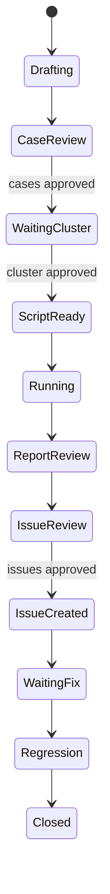

<p align="center">
  <picture>
    <source media="(prefers-color-scheme: dark)" srcset="assets/logo-dark.svg">
    <source media="(prefers-color-scheme: light)" srcset="assets/logo-light.svg">
    
  </picture>
</p>

<h1 align="center">FQA</h1>

<p align="center">
  面向 AI coding agent 的 feature 级 QA 编排流程，内置明确的人工审核关卡。
</p>

<p align="center">
  <a href="LICENSE"></a>
  <a href="skills/fqa/SKILL.md"></a>
  <a href="scripts/validate-skill.sh"></a>
</p>

<p align="center">
  <a href="README.md">English</a> | <a href="README_CN.md">简体中文</a>
</p>

---

大 feature 到 release review 时，经常只剩零散笔记、临时脚本和不完整证据。
FQA 把 feature QA 变成一条可追踪流程：理解设计、建模风险、生成 case、
等待人工审批、在集群执行、汇总发现、创建已批准的 issue，并在修复后回归。

## 演示

**你：**

```text
Use $fqa to test this feature PR. There is no design doc.
```

**Agent：**

```text
State: Drafting
- Read the code and generated planning/understanding/design-understanding.md
- Generated planning/understanding/implementation-understanding.md from changed components
- Checked understanding quality for evidence, confidence, and risk seeds
- Built a risk model covering API behavior, recovery, compatibility, and observability
- Expanded concrete variants into a scenario matrix with open decisions
- Checked generated cases for traceability, strong oracles, diagnostics, and flakiness controls
- Generated FQA-001 through FQA-008 test cases

Next gate: Please review and approve the test cases, then provide test-cluster access.
```



## 适合谁

| 如果你是... | FQA 可以帮你... |
| --- | --- |
| 正在 review 大 feature 的 maintainer | 把 PR 或分支转成有审核、有证据链的 QA 计划 |
| 验证 release 风险的 QA engineer | 生成集群级 case、脚本、报告和回归计划 |
| 生成测试产物的 AI agent | 遵循严格状态机，而不是即兴拼一个测试流程 |

## 核心特性

- 没有设计文档时，生成带 evidence 的 design 和 implementation understanding。
- 在生成 test case 前检查 understanding 的证据、confidence 和 risk seed。
- 将 test plan risk 和 case 追溯到 understanding risk seed。
- 用 scenario matrix 保留具体类型、操作、校验分支、边界值和系统模式。
- 检查 dimension coverage，避免在具体操作、类型、边界或模式仍有缺口时误标 covered。
- 将未决产品语义记录为 open decisions，不凭空生成预期。
- 检查生成的 case 是否具备覆盖矩阵、强 oracle、诊断证据和 flakiness 控制。
- 将 feature 风险转换成结构化、可审核的 test case。
- 在脚本生成、集群执行、issue 创建前强制人工 gate。
- 支持 local 和 remote 执行模式；local mode 会准备 Milvus worktree，并默认跳过大数据量 case。
- 提供 test plan、case、script、result、report、issue candidate 等模板。
- 将 workflow 存到统一的 FQA base dir，并用每个 feature 的 `state.yaml` 管理状态。
- 通过 dry-run 和 active-session 保护归档或删除单个 workflow。
- 用稳定 ID 串联 feature、case、run、failure、issue 和 regression。
- 面向集群级 QA，不把自己伪装成 unit-test 生成器。

## 快速开始

克隆项目，并把 skill 安装到 Codex skills 目录：

```bash
git clone https://github.com/weiliu1031/fqa.git
cd fqa
./scripts/install-skill.sh
```

从 release tag 更新已有安装：

```bash
git fetch --tags
git checkout v0.13.0
./scripts/install-skill.sh
```

也可以用 Codex 自带的 skill installer 直接从 GitHub 安装：

```bash
rm -rf ~/.codex/skills/fqa
python ~/.codex/skills/.system/skill-installer/scripts/install-skill-from-github.py \
  --repo weiliu1031/fqa \
  --path skills/fqa \
  --ref v0.13.0
```

安装或更新后需要重启 Codex。

校验 skill package：

```bash
./scripts/validate-skill.sh
```

在 agent 会话中使用：

```text
Use $fqa to generate feature-level test cases for this PR.
Use $fqa status.
Use $fqa resume fqa-example-20260508-pr123.
```

## 使用方式

### 开始 feature QA workflow

当用户要求 FQA 测试一个 feature 时，FQA 使用渐进式 intake。它会先询问
理解 feature 和生成 case 所需的最小信息；在 case 被批准之前，不会询问
集群凭证或执行权限。

**输入**

```text
Use $fqa to test this feature.
```

**输出**

```text
State: Drafting

I can start once I know the feature source and test scope.

Please provide one of:
- PR URL or number
- branch / commit / diff
- issue or design document
- local repo path and changed files

Optional but useful:
- release target
- compatibility target
- must-test scenarios
- forbidden operations

I will not ask for cluster credentials until test cases are approved.
```

### 从 feature branch 生成 case

**输入**

```text
Use $fqa to analyze this branch and generate feature-level test cases.
No design document is available.
```

**输出**

```text
State: CaseReview
Artifacts:
- ${FQA_BASE_DIR:-${CODEX_HOME:-~/.codex}/fqa}/features/<feature_id>/state.yaml
- planning/understanding/design-understanding.md
- planning/understanding/implementation-understanding.md
- planning/test-plan.yaml
- planning/cases/FQA-001.yaml
- planning/cases/FQA-002.yaml

Waiting for human approval before generating scripts.
```

### 执行已批准的 case

**输入**

```text
The cases are approved. Use local mode for this feature branch.
Build and start local Milvus before execution.
```

**输出**

```text
State: WaitingCluster
- local quick selected
- Planned local Milvus worktree for the target branch.
- Large-data and load-oriented cases will be skipped by default.

Next question: approve this local dry-run plan?
```

**输入**

```text
Use remote mode with endpoint alias staging-us-west and token alias qa-token.
Cleanup is allowed. Component restarts are not allowed.
```

**输出**

```text
State: ReportReview
Artifacts:
- execution/scripts/FQA-001.py
- execution/runs/RUN-20260508-153000-session/FQA-001.yaml
- closure/reports/test-report.md

Failures were classified into product bugs, test bugs, environment issues,
requirement ambiguity, and blocked coverage.
```

### 审核 issue candidate 并执行回归

**输入**

```text
Approve ISSUE-CAND-001 and ISSUE-CAND-003. Skip ISSUE-CAND-002.
Rerun regression after the fix PR is merged.
```

**输出**

```text
State: Regression
- Created approved issues only
- Linked issue IDs to case IDs and run IDs
- Reran failed and adjacent-risk cases after the fix
- Updated closure/reports/test-report.md with regression evidence
```

### 列出并恢复 workflow

**输入**

```text
Use $fqa status.
```

**输出**

```text
Feature ID | Feature | State | Session | Updated | Latest Run | Next Gate
fqa-example-20260508-pr123 | example | CaseReview | active | 2026-05-08T15:30:00Z | - | approve, reject, or edit test cases
```

**输入**

```text
Use $fqa resume fqa-example-20260508-pr123.
The test cases are approved.
```

**输出**

```text
State: WaitingCluster
Next gate: provide cluster access and execution permission.
```

### 清理 workflow

**输入**

```text
Use $fqa clean fqa-example-20260508-pr123.
```

**输出**

```text
Feature ID: fqa-example-20260508-pr123
Action: archive
Mode: dry-run
Result: dry-run only; add --force to execute
```

默认 cleanup 模式是 archive，因为它会保留 evidence。永久删除需要用户明确
提出 delete，并在当前对话中批准执行。

## 工作原理

FQA 是一个 Codex skill 加一组可复用模板：

```text
skills/fqa/
├── SKILL.md
├── agents/openai.yaml
├── references/
│   ├── artifact-schema.md
│   ├── intake-guidelines.md
│   ├── understanding-guidelines.md
│   ├── test-design-patterns.md
│   ├── issue-guidelines.md
│   ├── report-guidelines.md
│   ├── test-case-guidelines.md
│   └── workflow.md
├── scripts/
│   ├── fqa_check_cases.py
│   ├── fqa_check_understanding.py
│   ├── fqa_clean.py
│   ├── fqa_local_milvus.py
│   ├── fqa_status.py
│   └── fqa_validate_workspace.py
└── assets/templates/
    ├── design-understanding.md
    ├── feature-intake.yaml
    ├── implementation-understanding.md
    ├── issue-candidate.yaml
    ├── state.yaml
    ├── test-case.yaml
    ├── test-plan.yaml
    ├── test-report.md
    ├── test-run-result.yaml
    └── test-script-header.py
```

这个 skill 会控制加载到上下文里的内容量。`SKILL.md` 只保留状态机和防护规则；
详细 schema 和写作规则放在 `references/`；可复制的产物骨架放在
`assets/templates/`；确定性的 status、workspace 检查、cleanup 和 local Milvus
准备放在 `scripts/`。

默认情况下，生成的 workflow artifacts 会写到统一的全局 base dir：

```text
${FQA_BASE_DIR:-${CODEX_HOME:-~/.codex}/fqa}/features/<feature_id>/
├── state.yaml
├── intake/
├── planning/
│   ├── understanding/
│   └── cases/
├── execution/
└── closure/
```

这样 `status` 和 `resume` 可以跨 Git worktree 工作。repo-local `.fqa/`
只作为 pointer 或 legacy workflow 的兼容位置，不再是默认 artifact 存储目录。

## 版本管理

Skill 版本写在 `skills/fqa/SKILL.md` 的 `metadata.version: x.y.z` 字段中。

使用语义化版本：

- Patch：不改变 workflow 行为的文案、示例或模板修正。
- Minor：新增 workflow state、artifact、命令、gate 或 resume 行为。
- Major：不兼容的 artifact schema、状态机或审批契约变更。

发布版本时创建对应 Git tag：

```bash
git tag v<version>
git push origin v<version>
```

## 安全

FQA 是一个流程型 skill。这个仓库本身不会连接外部服务、保存凭证，也不会对集群
执行测试。

当 agent 在真实 feature 上使用 FQA 时：

- 不要在报告、日志或 issue 内容里打印 secret。
- 使用集群凭证前必须获得明确批准。
- 执行破坏性 cleanup、组件重启或故障注入前必须获得明确批准。
- 创建外部 issue 前必须获得明确批准。
- 除非已脱敏，不要把生成的 run artifacts 放进源码仓库。
- 全局 FQA base dir 应放在项目源码仓库之外。
- `.fqa/` 默认被忽略，因为 repo-local pointer 或 legacy artifacts 可能包含环境相关证据。

## 贡献

欢迎贡献。适合优先做的改进包括：

- 改进 artifact schema。
- 为特定产品领域添加示例。
- 收紧人工 gate 工作流。
- 添加 runner helper，同时保持相同的审批模型。

提交 PR 前请运行：

```bash
./scripts/validate-skill.sh
```

请保持 `README.md` 和 `README_CN.md` 的结构同步。

## 许可证

MIT License。见 [LICENSE](LICENSE)。
